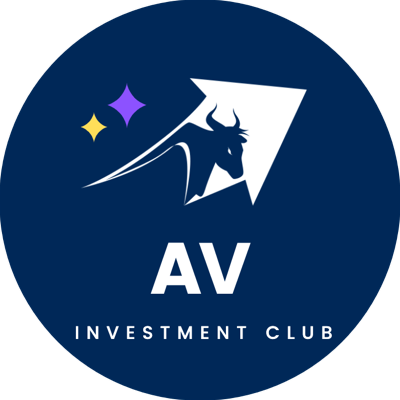

<p align="center"><a href="https://amadorinvest.org"></a></p>
<h1 align="center"><a href="https://amadorinvest.org">AVIC (Amador Valley Investment Club)</a></h1>
<p align="center">Simplifying investment, finance, and economics!</p>
<p align="center">
  <a href="https://github.com/avhsinvest/club-website/actions/workflows/integrate.yml"></a>
  <a href="https://amadorinvest.org/"></a>
</p>

## Contents <!-- omit in toc -->

- [Setup](#setup)

## Setup

1. Prerequisites

   - [Git](https://git-scm.com/), version `>=2.x`
   - [Node.JS](https://nodejs.org/en/), version `>=16.x`
   - [NPM](https://www.npmjs.com/), version `>=6.x`

2. Clone the repository

   ```shell
   git clone https://github.com/avhsinvest/club-website.git
   cd club-website
   ```

3. Install dependencies

   ```shell
   npm install
   ```

4. View Locally

   ```shell
   npm start
   ```
